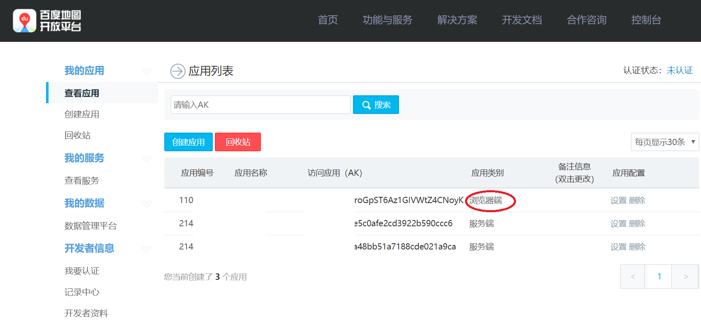
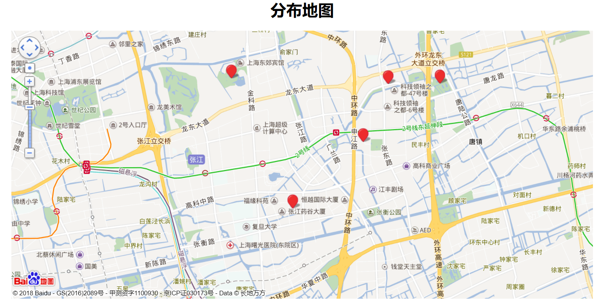

#  django_baidu_map
___________

使用百度地图显示地图标记点及标签。
Django using Baidu map javascript api to show points and tags。

### Steps

* 1. Apply for BaiduMap API key. Please go to [Baidu LBS](http://lbsyun.baidu.com/index.php?title=jspopular)

* 2. Paste the api to file `addressdemo/templates/address.html` [Baidu LBS](http://lbsyun.baidu.com/index.php?title=jspopular)

* 3. Run `python manage.py runserver` and open [web](http://127.0.0.1:8000/)

### Reference

* 1.[Django调用百度地图api在地图上批量增加标记点](https://www.jianshu.com/p/91cc0e5171f5)

* 2.[百度地图aJavaScript API v2.0类参考](http://lbsyun.baidu.com/cms/jsapi/reference/jsapi_reference.html#a1b0)
 
* 3.[在线经纬度查询](http://www.gpsspg.com/maps.htm)
